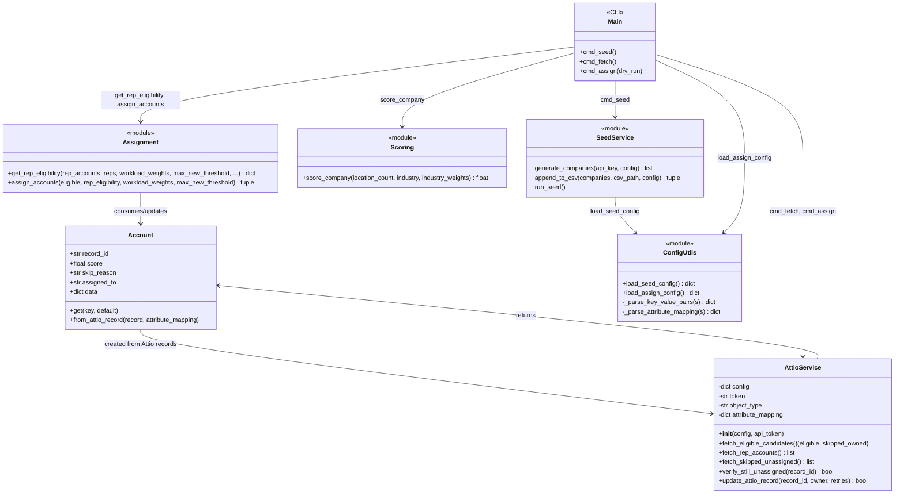
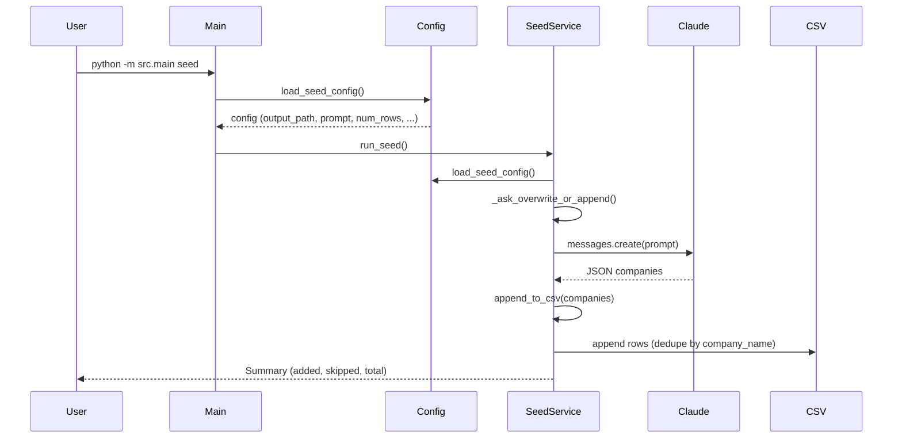
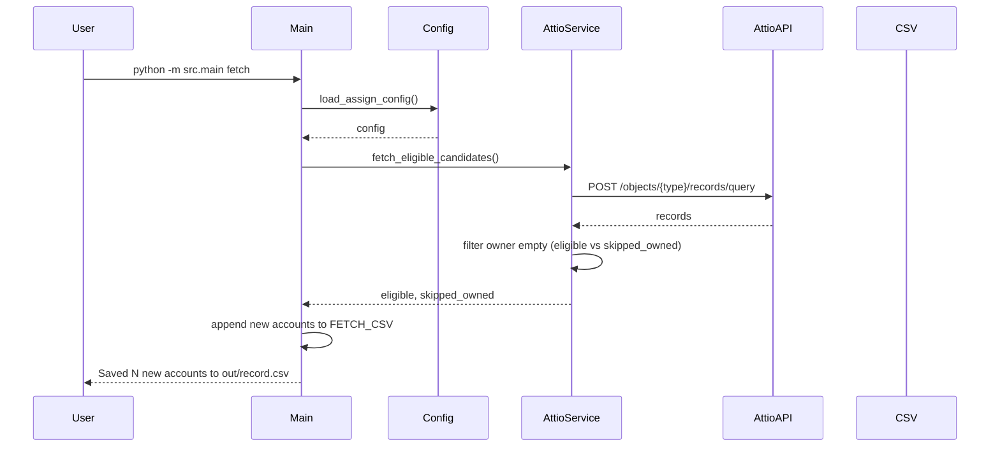
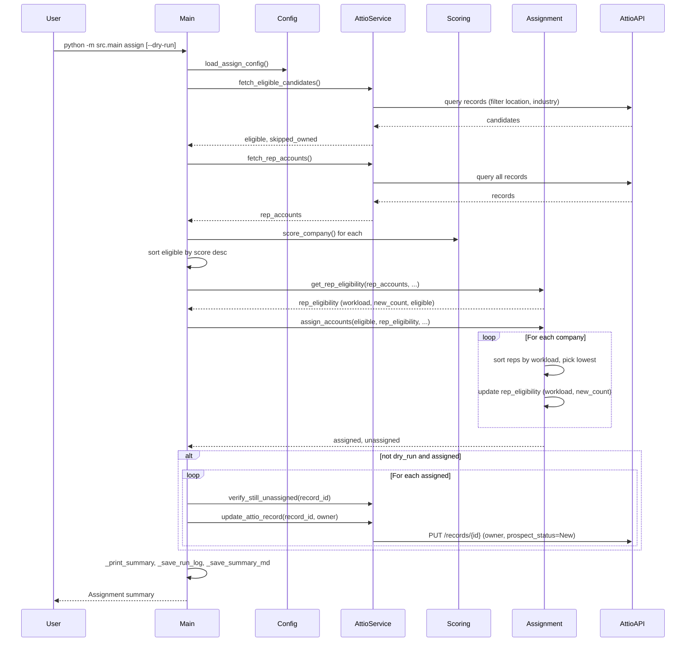

# Architecture Overview

Attio Account Assignment & Seed — a CLI application that seeds fictional company data via Claude and assigns unassigned Attio accounts to sales reps using workload-weighted round-robin.

---

## High-Level Architecture

```
┌─────────────────────────────────────────────────────────────────────────┐
│  CLI (main.py)                                                           │
│  seed | fetch | assign [--dry-run]                                       │
└───────────┬─────────────────────────┬───────────────────┬────────────────┘
            │                         │                   │
            ▼                         ▼                   ▼
┌───────────────────┐   ┌─────────────────────┐   ┌─────────────────────────┐
│  SeedService      │   │  AttioService       │   │  Assignment Pipeline    │
│  (seed_service)   │   │  (attio.py)         │   │  (assignment.py,        │
│                   │   │                     │   │   scoring.py)           │
│  • Claude API     │   │  • Fetch records    │   │                         │
│  • CSV append     │   │  • Update owner     │   │  • Rep eligibility      │
│                   │   │  • Verify unassigned│   │  • Workload sort        │
└────────┬──────────┘   └──────────┬──────────┘   │  • Round-robin assign   │
         │                         │              └────────────┬────────────┘
         │                         │                           │
         ▼                         ▼                           ▼
┌─────────────────┐   ┌─────────────────────┐   ┌─────────────────────────┐
│  config/seed.txt│   │  Attio API (HTTP)   │   │  config/assign.txt      │
│  CSV output     │   │  objects/*/records  │   │  (reps, thresholds,     │
└─────────────────┘   └─────────────────────┘   │   weights, mapping)     │
                                                └─────────────────────────┘
```

**Layers:**
- **CLI** — Entry point; dispatches to seed, fetch, or assign.
- **Services** — External I/O: Claude API, Attio API, file I/O.
- **Core** — Pure logic: scoring, rep eligibility, assignment algorithm.
- **Config** — Plain-text `config/*.txt` files (KEY = value).
- **Models** — `Account` dataclass; schema-agnostic via `data` dict + attribute mapping.

---

## Class Diagram



---

## Sequence Diagrams

### Seed Flow



### Fetch Flow



### Assign Flow



---

## File Layout

```
├── config/
│   ├── seed.txt       # Seed: output path, prompt, columns, row count
│   └── assign.txt     # Assign: reps, thresholds, weights, attribute mapping
├── docs/         
│   └── ARCHITECTURE.md       #Architecture overview, flows, project structure
│   ├── DESIGN_DECISIONS.md   #System goal, assumptions, scoring logic
│   └── ERROR_HANDLING.md     
│   ├── IDEMPOTENCY.md        
│   ├── IMPROVEMENTS.md      #Future improvements, tricky bits
│   └── SUMMARY_OF_FILES.md 
│   └── TESTING.md           #Unit tests, testing coverage
├── out/               # Outputs (gitignored)
│   ├── seed_companies.csv
│   ├── record.csv
│   ├── assignment_log.json
│   └── summaries/
├── scripts/
│   └── run_local.sh
├── simulations/
│   └── monte_carlo_simulation_round_robin_order.jsx
├── src/
│   ├── main.py        # CLI entry
│   ├── core/
│   │   ├── assignment.py   # Rep eligibility, round-robin assign
│   │   └── scoring.py      # location × industry score
│   ├── models/
│   │   └── account.py      # Account dataclass
│   ├── services/
│   │   ├── attio.py        # Attio API client
│   │   └── seed_service.py # Claude + CSV
│   └── utils/
│       └── config.py       # Load config/seed.txt, config/assign.txt
└── tests/
```
